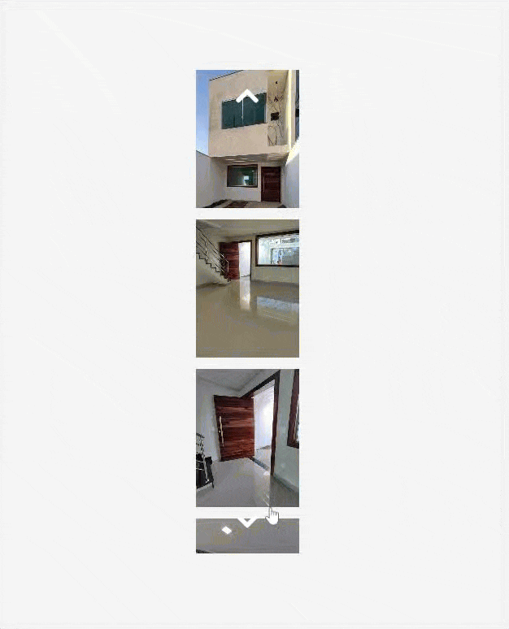

# Carousel_Vertical_Maior

Um Carousel (Slides) em pé que move na vertical

Na falta de um Carousel que rodasse em pé, fui atras de usar o (ChatGPT)[chat.com] para fazer um que funcionasse na vertical.

Esse modelo permite que multiplas fotos sejam implementadas.

